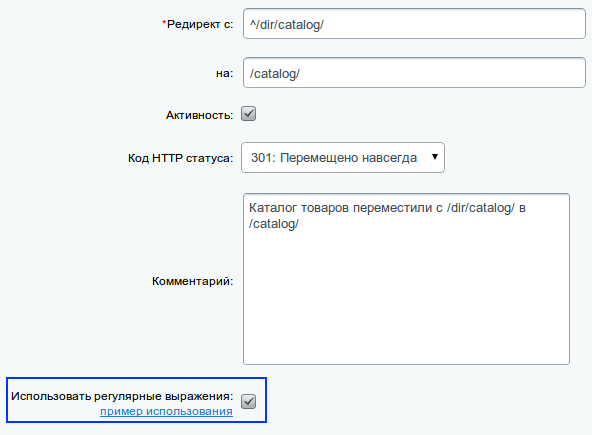
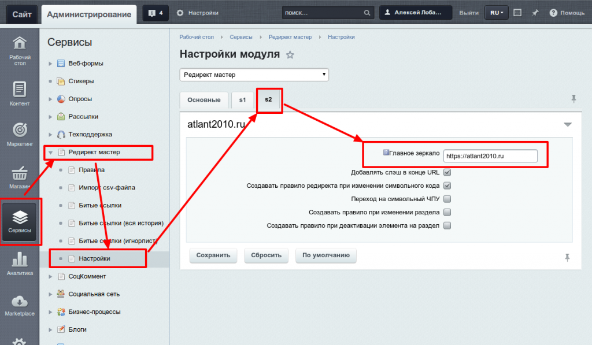

# redirects.master

Модуль устанавливается при помощи стандартного механизма установки решений.

После установки Вы можете перейти к его настройке, нажав соответствующую кнопку.

Путь к модулю:
Сервисы > Редирект мастер

Описание

Модуль "Редирект мастер" решает всевозможные задачи, связанные с настройкой редиректов в Битрикс.


Документация:

**Сложные правила редиректов (Редирект мастер)**
Иногда бывает необходимым переформировать расположение данных на сайте, сменив URL того или иного раздела. Это может быть вызвано разными причинами - внутренней SEO оптимизацией, эстетическими соображениями и т.п.

Для того чтобы прежние страницы не выпали из индекса поисковых систем и сохранились все достижения этих страниц, необходимо настроить редиректы со всех старых страниц на новые.

Но проблема состоит в том, что на сколько-нибудь объемном каталоге товаров просто нереально настроить редиректы для каждой страницы каталога. Ведь таких страниц обычно тысячи.

Наше решение подобных проблем - использование модуля Редирект Мастер!

В одном из последних обновлений этого модуля для Битрикс появилась возможность создавать сложные правила редиректов, используя регулярные выражения.

Использование регулярных выражений довольно сложно в понимании, поэтому лучше обратиться за помощью к программисту.

А в данной статье мы рассмотрим новые возможности модуля на конкретных примерах из жизни сайтов.

Для того, чтобы переключиться в расширенный режим настроек правила, необходимо поставить галочку "Использовать регулярные выражения".



Пример
Каталог товаров переместили из папки /dir/catalog/ в папку /catalog/

Для того, чтобы решить проблему с настройкой редиректов, необходимо добавить всего одно правило.

В поле "редирект с" необходимо прописать правило "^/dir/catalog/", а в поле "редирект на" - "/catalog/".

Символ ^ в начале правила означает, что данное правило не будет срабатывать, если путь dir/catalog/ будет использоваться внутри других папок. К примеру, на страницах/smth/dir/catalog/ и /smth1/smth2/dir/catalog/ данное правило не будет срабатывать.

После активации данного правила все url, на которые заходит пользователь, будут проверяться на совпадение с правилом "^/dir/catalog/". И если совпадение найдено, то будет сформирован новый url по следующему правилу:

В текущем url подстрока "/dir/catalog/" заменится на "/catalog/". После этого пользователь будет перемещен на новый url.

Созданный таким образом редирект будет срабатывать на всех внутренних страницах каталога (страницы подразделов, товаров и т.д.).

Примечание

Если в данном каталоге используется ЧПУ, то необходимо убедиться, что в настройках компонента каталога ЧПУ настроено на новые url.

**Редирект https в Битрикс**
Давайте рассмотрим, как легко можно настроить редирект с http на https в Битрикс (и обратно).

Рассмотрим данную задачу на примере нашего сайта - site.ru.
В качестве главного зеркала сайта мы используем адрес https://site.ru.
Значит для оптимального восприятия сайтом поисковыми системами со всех неглавных зеркал нужно настроить редирект. Причем даже для всех внутренних страниц.
К примеру, http://site.ru должен вести на https://site.ru, http://site.ru/services/tehpodderzka-bitrix/ - должен редиректить на https://site.ru/services/tehpodderzka-bitrix/ и т.д.

Такой редирект очень легко можно настроить с помощью модуля Редирект Мастер.
После его установки нужно просто зайти в настройки модуля и прописать главное зеркало для сайта. В нашем случае, прописываем "https://site.ru".
Обратите внимание, модуль поддерживает многосайтовость.



**Программно добавить редирект в базу**

```php
if(CModule::IncludeModule("redirects.master")) {
  seo2RedirectsRulesDB::Add(array(
    'OLD_LINK' => '/wrong-url/', // старая ссылка
    'NEW_LINK' => '/right-url/', // новая ссылка
    'DATE_TIME_CREATE' => ConvertTimeStamp(time(), 'FULL'), // дата/время создания правила
    'STATUS' => 301, // http статус (301, 302 и т.д.)
    'ACTIVE' => Y, // активность
    'COMMENT' => 'автоматическая генерация, ссылки со старого сайта', // комментарий
    'SITE_ID' => 's1', // ID сайта
    'WITH_INCLUDES' => N, // все вхождения
    'USE_REGEXP' => N, // использовать сложные правила редиректов (регулярные выражения)
  ));
}
```


Модуль фиксирует все такие заходы и предлагает далее настроить с тех несуществующих страниц редиректы в админке Битрикс, чтобы ваши потенциальные клиенты все же находили нужную им информацию (товар или услугу), а поисковые системы не понижали позиции сайта в поисковой выдаче.


Модуль по настройке redirect для bitrix будет незаменим в следующих ситуациях:
- Изменение URL страниц (реорганизация в меню, в каталоге и т.п.).
Настроив редиректы со старых URL на новые, вы сохраните позиции в поисковиках;
- Переезд на Битрикс.
Даже если URL страниц теперь новые, вы легко можете настроить нужны редиректы в битриксе с помощью нашего модуля.
- Решили удалить страницу.
Редирект мастер поможет вам правильно настроить редирект 410, сообщив поисковым системам об удаленных страницах.;
- Поменяли логику ЧПУ.
Теперь вместо id элементов в адресе используется символьный код. Модуль позволит в 2 клика настроить редирект со старых адресов на новые.
- Хотите настроить редирект в bitrix с www на без www (или наоборот)
- Хотите настроить редирект для https (SSL)
- Нужно сделать редирект со страниц без слеша в конце на страницы со слешем в конце URL
- В рамках SEO вы настроили главное зеркало и нужно сделать, чтобы только главное зеркало было доступно (а с остальных - проходил редирект на главное).


Модуль редиректов для Битрикс поддерживает различные коды редиректов:
- редирект 301 (перемещено навсегда)
- редирект 302: (перемещено временно)
- редирект 303: (смотреть другое)
- редирект 410: (удалено)

Возможности нашего модуля “Редирект мастер”
- Создание редиректов 301 для Битрикс в визуальном режиме в панели управления сайтом (также поддерживаются редиректы 302, 303, 410).
- Поддержка многосайтовости ядра 1С-Битрикс. Редиректы создаются и отрабатывают с учетом многосайтовости.
- Фиксирование всех переходов на страницы сайта по битым ссылкам (несуществующие страницы 404)
- Возможность создать редиректы с каждой найденной битой ссылки.
- Сбор подробной статистики по битым ссылкам - суммарное количество переходов, информация о посетителе - ip, география, браузер и т.д. (при наличии типового модуля ядра Веб-аналитика)
- Указание главного зеркала сайта (главного домена) - заходы на сайт по другим доменам будут автоматически перенаправляться с учетом вложенности
- Логика "все вхождения", которая создает редирект не только с точного адреса, но и с любых вхождений данного адреса.
- Редирект автоматического добавления слеша в конце URL.
- Импорт редиректов из excel.
- Отслеживание изменений символьного кода товаров (и прочих элементов) - автоматическое создание редиректов со старого адреса на новый.
- Логика редиректов с регулярными выражениями (для опытных специалистов)
- Временное отключение функций модуля. Можно отключить сохранение битых ссылок или функцию редиректов (правила при этом не удаляться из списка)
- Ротация битых ссылок. Настройка, позволяющая указать макс. количество истории переходов по битым ссылкам.


Технические подробности.

Текущая версия модуля встраивается в API Битрикс и работает без использования файлов htaccess или bitrix urlrewrite. Все редиректы происходят через функцию API Битрикс LocalRedirect.